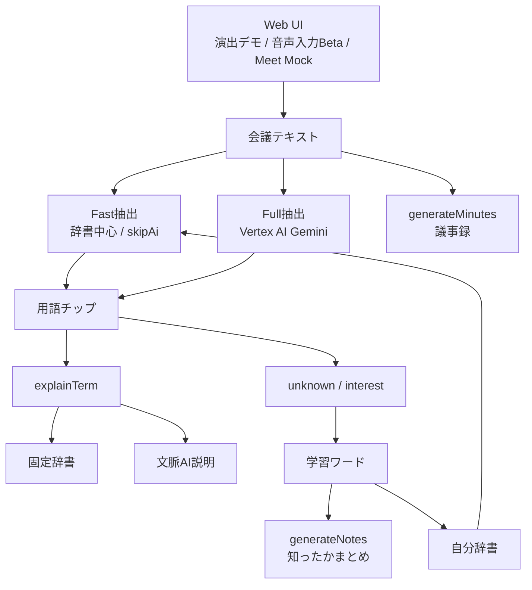
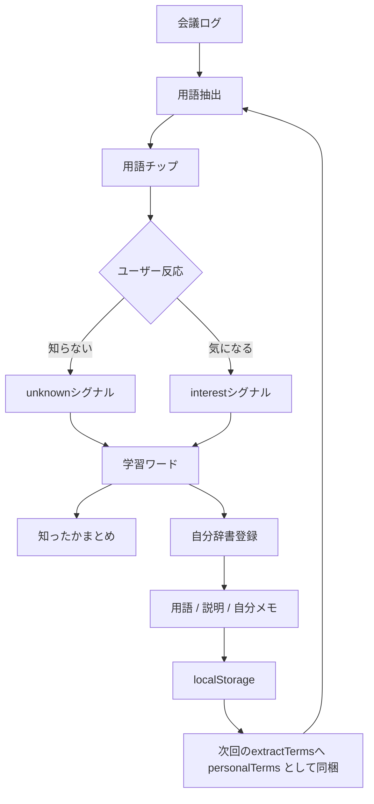

会議ってたまに知らない言葉が飛んでくる。

いや、たまにじゃないな。

知らない言葉が飛んでくる。
知らない略語が飛んでくる。
知らない社内用語が飛んでくる。
知らないのに、なぜか全員知ってる顔で進んでいく。

あれ、なんなんだろうね。

「それってどういう意味ですか？」と聞けばいい。

正論。

でも人間はそんなに強くない。

会議中に毎回それをやると、話の腰を折る。
自分だけ理解していない感じも出る。
しかも聞いたところで、説明が説明になってないこともある。

だから作った。

会議で知ったかするためのAIエージェント。

名前は「知ったかくん」。

## 先にまとめ

知ったかくんは、会議中に出てきた専門用語をリアルタイムに拾い、固定辞書・自分辞書・AI説明へ振り分ける会議支援ツールです。

普通の議事録ツールではなく、「この会議で自分は何を知らなかったのか」を見える化し、会議後の学習につなげることを目的にしています。

今回の実装では、低遅延を重視して Fast抽出 と Full抽出 を分け、すべてをAIに投げず、Dictionary Dispatcherで説明元を切り替える構成にしました。

# デモ動画

ここにデモ動画を置く。

@[youtube](ここにYouTubeの動画ID)

【差し込み　画像1】記事冒頭用。知ったかくんのロゴか、デモ画面全体が一目で見えるスクショ。できれば「会議ログ」「抽出用語」「説明カード」「学習ワード」が同時に入っている状態。

# 作ったもの

知ったかくんは、会議中に出てきた用語を拾って、あとからそれっぽく理解できるようにするツールです。

議事録要約ツールではない。

そこはちょっと違う。

議事録って、会議の内容をまとめるものじゃん。

知ったかくんは、会議に出てきた「わからん」を拾う。
拾った用語をチップにする。
分野ごとの辞書に振り分ける。
必要ならAIに文脈込みで説明させる。
「知らない」「気になる」と反応した語を残す。
最後に「知ったかまとめ」を作る。

つまり、会議の内容そのものよりも、

「この会議で僕は何を知らなかったのか」

を見えるようにするツールです。

地味だけど、ここが大事だと思う。

議事録を作れる機能も入っている。

でも主役は議事録ではない。

主役は、会議中に自分だけ置いていかれるあの瞬間です。

【差し込み　画像2】「会議ログから用語がチップ化されている画面」。ログ中の ADR / RAG / SKU などがハイライトされ、右側に抽出用語チップが並んでいるスクショ。

# 何ができるか

できることはだいたいこんな感じ。

- 会議ログをリアルタイム風に流す
- 発言の中から専門用語っぽいものを抽出する
- 抽出した用語をチップとして表示する
- IT、医療、福祉、経営、製造、服飾、ギャル、オタク系などの辞書に振り分ける
- 固定辞書にある用語は即座に説明する
- 固定辞書にない用語は、文脈を見てAIが説明する
- 「知らない」「気になる」のクリックを別の意味として記録する
- クリックした語から、会議後の「知ったかまとめ」を作る
- 会議全体の議事録も作れる
- 学習ワードを自分辞書に登録できる
- 自分辞書のメモを編集できる
- 音声入力Betaとして Web Speech API / Google Cloud Speech-to-Text を選べる
- Google Meet取込の導線をMockとして試せる
- Debug表示で、用語がどの経路から来たか見られる

会議中に完璧に理解する必要はない。

あとで追いつけばいい。

たぶん人類の会議の8割はそれでなんとかなる。

# なぜ作ったか

会議のしんどさって、話が長いことじゃないと思う。

知らない言葉が混ざった瞬間に、理解が一段落ちることだと思う。

1個知らない用語が出る。

まあなんとかなる。

2個知らない用語が出る。

雰囲気で聞く。

3個知らない用語が出る。

急に会議全体が霧になる。

しかもその場で検索しても、会議の文脈に合った説明が出るとは限らない。

たとえば「dispatcher」という言葉が出たとしても、OSの話なのか、物流の話なのか、フロントエンドの話なのか、業務担当の話なのかで意味が変わる。

単語だけを調べてもダメなんだよね。

会議の文脈込みで拾わないといけない。

だから、ただの用語辞書ではなく、

「会議の中で出てきた知らない言葉を、あとから知ったかできる形にする」

という方向にした。

知ったかぶりは悪いことだと思われがちだけど。

僕はそうでもないと思ってる。

知らないことを知らないまま放置するのはよくない。
でも、その場で全部止めるのも現実的じゃない。

だったら一回知ったかで乗り切って、あとでちゃんと追いつけばいい。

それはもう学習だと思う。

ちょっと顔つきが悪いだけで。

# 知らないことは恥だと思う

「知らないことは恥ではない」

よく聞く。

きれいな言葉だと思う。

でも、僕はちょっと違うと思っている。

知らないことは恥だ。

少なくとも、会議中に自分だけ言葉の意味がわからなくて、周りが当然みたいな顔で進んでいく時、人はちゃんと恥ずかしい。

焦る。
黙る。
わかった顔をする。
あとでこっそり検索する。

それは弱さだけど、かなり人間らしい弱さだと思う。

だから知ったかくんは、その恥を否定しない。

知らないことは恥だ。

だから、その場では知ったかで乗り切る。
そして、あとでちゃんと追いつく。

恥をなくすツールではない。

恥を、学習の入口に変えるツールです。

大げさに言うと。

でも、たぶんそう。

# 画面の流れ

画面はかなりデモ向けに作った。

左側に操作パネル。
中央に会議ログ。
右側に抽出された用語や説明。
下側に議事録と知ったかまとめ。

会議の発言は、リアルタイム風に流れる。

ログが流れる。
用語がハイライトされる。
右側にチップが出る。
チップを押す。
かんたんな説明が出る。
「なんとなく発言例」も出る。

会議で一番欲しいのって、完璧な説明じゃない時がある。

「あ、今の話ってそういう意味ね」

くらいの足場。

その足場があるだけで、次の発言が少し聞きやすくなる。

【差し込み　画像3】用語詳細カードのスクショ。用語チップを押したあと、「かんたんな説明」「なんとなく発言例」「知らない」「気になる」が見えている状態。

# 音声入力はBetaにした

最初は、音声認識を本気で入れようと思っていた。

マイク。
ブラウザ権限。
話者分離。
無音判定。
ノイズ。
句読点。
ブラウザ差分。

ちょっと待て。

これはハッカソンじゃなくて音声認識地獄だ。

なので今回は、本番品質の音声認識基盤を主軸にはしなかった。

ただし、音声入力のBeta導線は入れた。

Web Speech API。
Google Cloud Speech-to-Text。
マイク入力。
ブラウザタブ音声。

入れた。

Speech-to-Text の方は、ブラウザで数秒ごとに録音した音声を Cloud Run 経由で中継する方式にした。

認証はサーバ側のADCで完結するので、ブラウザにキーを置かない。

キーレスは正義。

入れたけど、主役にはしない。

今回見せたいのは、マイクが動くことではなく、

「会議の中の知らない言葉が、どうやって知識に変わるか」

だったから。

音声は入口。

知ったかくんの本体は、その後にある。

【差し込み　画像4】音声入力Betaのタブ。Web Speech API / Google Cloud Speech-to-Text、マイク / ブラウザタブ音声の選択肢が見えるスクショ。キャプションでは「本番品質ではなくBeta」と明記すると誤解が少ない。

# アーキテクチャ

ざっくり言うとこう。



【差し込み　画像5】全体アーキテクチャ図。上のMermaidを画像化してもOK。Web UI、Cloud Run、辞書、Vertex AI Gemini、localStorage、自分辞書の関係が見える図。

構成としてはこう。

- フロントエンド: HTML / CSS / Vanilla JS
- バックエンド: Cloud Run（Node.js / TypeScript、静的UIとAPIを1コンテナ同居）
- AI接続: Vertex AI 経由の Gemini 2.5 Flash（APIキーレス・ADC認証）
- 音声入力Beta: Web Speech API / Google Cloud Speech-to-Text
- 保存: localStorage / sessionStorage
- 辞書: 固定辞書 + プロジェクト辞書 + 自分辞書

実装したAPIは主にこの4つ。

- `extractTerms`: 会議テキストから用語候補を抽出する
- `explainTerm`: 選択した用語を会議文脈込みで説明する
- `generateNotes`: 学習ワードから知ったかまとめを作る
- `generateMinutes`: 会議全体の議事録を作る

会議ログを受け取って、用語を拾って、説明して、クリックを残して、最後にまとめる。

言うと簡単。

作ると普通にめんどくさい。

# 会議中は、賢さより止まらなさ

今回かなり意識したのは、会議中に使うツールとしての体感速度です。

AIって賢い。

でも遅い時がある。

そして会議中の「遅い」は、かなり致命的です。

知らない言葉が出た。
意味を知りたい。
AIが考えている。
まだ考えている。
会議は次の話題に行った。

終わりです。

もうその説明がどれだけ正しくても遅い。

だから、抽出は2段階にした。

まず Fast抽出。

`skipAi=true` で辞書中心に先に出す。

固定辞書やディスパッチャで拾えるものは、AIを待たずにチップ化する。

その後で Full抽出。

一定間隔でAI込みの抽出を走らせて、取りこぼした用語を補う。

いきなり全部AIに考えさせない。

先に出せるものを出す。
あとから賢くする。

会議支援では、この順番が大事だと思った。

賢いけど止まるツールより、

そこそこ賢くて止まらないツールのほうが助かる場面がある。

会議は待ってくれない。

人間にももう少し優しくしてほしい。

# AIプロダクトなのに、AIをなるべく呼ばない

AIエージェントというと、なんでもAIに投げたくなる。

でも実際には、全部AIに投げると道具として弱くなることがある。

たとえば「KPI」みたいな用語は、毎回AIに聞かなくていい。

固定辞書でいい。

意味はだいたい決まっている。

一方で、会議の中で「このPJのKPIはオンボーディング完了率です」と言われたら、そこは文脈が必要になる。

KPIという一般用語の説明だけでは足りない。

さらに言うと、前回の会議で僕がKPIを「知らない」と押していたなら、次に出てきた時は先に教えてほしい。

人間はそんなに急に賢くならない。

昨日知らなかった言葉は、今日もだいたい怪しい。

だから、役割を分けた。

- 固定辞書で即答できるもの
- Dictionary Dispatcherで拾うもの
- 自分辞書から再表示するもの
- 文脈を見ないと説明できないもの
- 会議後にまとめるべきもの

このあたりを分けた。

たぶんここが、ただのチャットAIではなく、会議向けのエージェントとして必要なところだと思う。

「AIを使う」よりも、

「AIをどこで使わないか」

のほうが、実装では大事だった。

AIに全部任せると、説明が揺れる。
コストも増える。
速度も落ちる。
同じ用語なのに毎回少し違う説明になる。

それは会議中の補助ツールとしては少し気持ち悪い。

固定できるものは固定する。
揺らぐべきところだけAIに任せる。

その方がツールとしては安定すると思う。

# 辞書とディスパッチャ

辞書は分野ごとに分けた。

IT。
医療。
福祉。
経営。
製造。
服飾。
ギャル。
オタク。

なぜギャルとオタクがあるのか。

会議に出るからです。

出るんだよ。
ほんとに。

専門用語というのは、別に医療やITだけにあるものではない。

職場ごとの言い回し。
業界ごとのノリ。
謎の略語。
その場の文化。
知っている人だけがわかる言葉。

全部、知らない人から見たら専門用語になる。

だから辞書も、少しふざけた顔をしているくらいでちょうどいいと思った。

知ったかくんは、出てきた用語を見て、どの辞書に近いかを判断する。

これを Dictionary Dispatcher と呼んでいる。

えらそうな名前だけど、やってることは地味です。

でもこの地味な部分がないと、全部AIに丸投げになる。

それはそれで怖い。

内部では、用語一致、alias一致、大文字略語、文脈カテゴリ、反復出現みたいな情報を見てスコアリングする。

そして、どの辞書から説明を出すかを決める。

見た目上は、ただチップが出ているだけ。

でも裏側では、

「これは固定辞書でいい」
「これは文脈AIに回した方がいい」
「これは自分辞書にあったやつだ」

みたいな判断をしている。

この「どこに聞くか」を決める部分が、今回いちばんエージェントっぽいところだったと思う。

【差し込み　画像6】Dictionary Dispatcherの説明図。固定辞書、分野別辞書、自分辞書、AI説明へ分岐する図。スコアリングや優先順位が軽く見えると技術記事っぽさが出る。

# 自分辞書

ここまで読むと、「固定辞書とAIがあれば十分では？」となる。

気持ちはわかる。

でも実際の会議は、もっと個人的だ。

同じ言葉でも、僕は知らないけど隣の人は知ってる、みたいなことが起きる。

逆もある。

だから知ったかくんには、自分辞書を持たせた。

これは単なる単語帳じゃない。

「自分がどこで詰まったか」の履歴です。

会議中に「知らない」「気になる」を付けた語を残しておく。
会議後に学習ワードとしてまとめる。
必要なら自分辞書へ登録する。
メモも残せる。
次に同じ語が出たら、自分向けの文脈として再利用できる。

つまり、

みんな向けの正解じゃなくて、
自分が追いつくための説明を育てる辞書。

知ったかは一回で終わらない。

同じ会議文化の中で、少しずつ減っていく。

そのための仕組みが、自分辞書です。

## 自分辞書まわりの流れ

自分辞書だけ別に見ると、こんな感じ。



【差し込み　画像7】自分辞書アーキ図。上のMermaidを画像化してもOK。`知らない/気になる -> 学習ワード -> 自分辞書 -> 次回抽出に再利用` の循環が見える図。

この設計で気をつけたのは、自分辞書を評価や監視にしないこと。

「この人は理解力が低い」

みたいな判定を作りたいわけじゃない。

そんなツール、会議よりしんどい。

自分辞書は、弱点リストではない。

成長ログです。

昨日つまずいた言葉を、今日ちょっと拾いやすくする。

それくらいでいい。

人間を管理しようとすると、だいたいろくなことにならない。

# 知ったかまとめと議事録は別物

会議終了後には、2種類の出力を作れる。

ひとつは議事録。

要点。
決定事項。
未確定事項。
次アクション。

これは普通に便利。

でも知ったかくんとして大事なのは、もうひとつの出力です。

知ったかまとめ。

これは会議全体のまとめではない。

自分が「知らない」「気になる」と押した語だけを中心に、会議文脈付きでまとめる。

つまり、普通の議事録が

「この会議で何が話されたか」

だとしたら、知ったかまとめは

「この会議で自分はどこに置いていかれたか」

です。

この差は大きい。

議事録を読んでも、わかった気になるだけのことがある。

でも、自分が詰まった語だけが並んでいると、逃げ場がない。

ああ、ここだ。

ここで僕は会議から落ちたんだ。

そういう感じになる。

つらい。

でも便利。

【差し込み　画像8】会議終了後の「議事録」と「学習ワードの会議文脈付きまとめ」が並ぶ画面。可能なら、議事録と知ったかまとめの違いがわかるように2枚並べる。

# Google Cloud を使ったところ

今回の構成は、Google Cloud に全部乗せた。

実装の中心に置いたのは Cloud Run だ。

Cloud Run の1サービスに、静的UIの配信と、以下のAPIを1コンテナで同居させた。

`extractTerms`
`explainTerm`
`generateNotes`
`generateMinutes`
`transcribeAudio`

このへん。

AI呼び出しは、Vertex AI 経由の Gemini 2.5 Flash。

用語抽出。
用語説明。
知ったかまとめ。
議事録生成。

ここを、それぞれ別のAPIとして分けた。

Vertex AI ルートの良いところは、APIキーが一切いらないこと。

Cloud Run のサービスアカウントのADC（Application Default Credentials）で認証するので、コードにも環境変数にもキーが存在しない。

漏れるキーがなければ、キーは漏れない。

当たり前のことを言っているようで、これがいちばん強いセキュリティだと思う。

デプロイは `gcloud run deploy --source .` の一発。

Cloud Build が Dockerfile を拾ってビルドして、Artifact Registry に置いて、リビジョンを切り替えてくれる。

min-instances=0 にしてあるので、誰も使っていない時のコストはゼロ。

ハッカソンの財布に優しい。

一方で、Google Cloud Speech-to-Text や Google Meet 連携は、今回は Beta / Mock 導線として扱っている。

音声入力は試せる。
Meet取込の流れも見せられる。

でも本番品質の Meet 連携として完成させたわけではない。

そこは正直に分けておきたい。

盛るとあとで自分が苦しくなる。

ちなみにこのプロジェクト、最初は別のハッカソン向けに Azure Functions + Azure OpenAI で作っていた。

それを今回、Cloud Run + Vertex AI Gemini に丸ごと移行した。

ハンドラのインターフェースを薄いアダプタで包んで、AIクライアントをプロバイダ切替式にしておいたおかげで、移行の本体は思ったより小さく済んだ。

構成を疎結合にしておくと、クラウドごと引っ越せる。

DevOps的な学びとしては、これが今回いちばん大きかったかもしれない。

ローカルで Node サーバを立てる。
フロントから叩く。
辞書で先に返す。
AIが使える時だけ補う。

この構成にしたおかげで、クラウド側が詰まってもUIや辞書の検証は進められた。

これは地味に大事だった。

# まわす — CI/CDとスモークゲート

実はこのプロジェクト、一度だけ本番をしくじっている。

環境変数をまとめて更新したとき、シェルの引数解釈でカンマ区切りが分解されて、すべての環境変数が1個目の値に連結された。

結果、Vertex AI の設定が消えて、AI説明が全部辞書フォールバックになった。

アプリは止まっていない。エラーも出ない。ただ、AIだけが静かに死んでいた。

これが一番怖いタイプの事故だと思う。

なので、デプロイを Cloud Build のパイプラインに組み直した。

流れはこう。

1. main に push
2. Cloud Build がコンテナをビルド
3. 新リビジョンを `--no-traffic` でデプロイ（本番トラフィックは旧リビジョンのまま）
4. candidate タグのURLに対してスモークテストを実行
5. 全部通ったときだけ、本番トラフィックを新リビジョンに切り替え

つまり、ゲートを通るまで新コードはユーザーに届かない。

スモークテストの中身は、実際に踏んだ地雷のチェックリストそのものだ。

- UI画像が404になっていないか（gcloudignore の解釈違いで一度全部消えた）
- explainTerm の source が `vertex_gemini` か（環境変数事故の再発検知）
- Speech-to-Text 中継が生きているか
- 不正なパーセントエンコーディングやパストラバーサルをちゃんと弾いているか

「AIだけが静かに死ぬ」を、ゲートが止めてくれる。

事故は防げない。でも、同じ事故を二度踏むのは選択だ。

ついでに、ディスパッチャの判断過程をUIにも出すようにした。

「エージェント実行ログ」パネルに、リクエストごとの判断がそのまま流れる。

```
fixed_dictionary: profile=system_development ヒット3件
dispatcher: 全辞書スキャン: 候補3件 → 0件採用
ai_extract: skipAi=true のためAIを呼ばない (Fast抽出モード)
decision: source=fixed_dictionary / 用語3件を返却
```

どこでAIを呼び、どこで呼ばなかったか。

エージェントの自律判断は、見えないと存在しないのと同じなので。

# 今回あえて主軸にしなかったもの

ハッカソンなので、やりたいことを全部やると死ぬ。

死ぬというか、完成しない。

なので、今回はあえて主軸にしなかったものがある。

## 本格的なマルチエージェント・オーケストレーション

複数エージェントで深く考えさせる構成も考えた。

でも会議中の支援では、深い推論よりも「今この瞬間に意味がわかる」ことが重要になる。

複数のAI呼び出しを重ねると、応答時間もトークン消費も増える。

挙動の見通しも重くなる。

今回は、そこに複雑性を足すより、固定辞書と文脈AIを Dictionary Dispatcher で切り替える構成にした。

低遅延で説明を返す方を優先した。

会議中に30秒待つ知性は、だいたい遅刻です。

## ログイン・マイページ・ユーザー別DB

自分辞書や学習プロフィールをちゃんと継続管理するには、本来はログイン、マイページ、ユーザー別DB、権限管理が必要になる。

でも今回はそこを主戦場にしなかった。

そこまでやると、急にプロダクト運用の話になる。

今回検証したかったのは、

「会議中に言葉を拾う」
「その場で意味を補足する」
「あとで自分の学習に変える」

この体験です。

なので、デモでは localStorage / sessionStorage を中心にした。

まず価値を見せる。

その後で永続化を考える。

順番としてはこれでよかったと思う。

## Google Meet の本番連携

Google Meet REST API とつなげば、かなり実用に近づく。

本当はやりたい。

Meet の会議URLから conferenceRecords を解決して、transcript を取りに行って、そのまま知ったかくんに流す。

めちゃくちゃ良い。

でも本番連携は、OAuth同意とWorkspaceの権限と組織設定が絡む。

ここもハッカソンで沼になりやすい。

なので今回は Meet取込はMock導線にした。

「将来こうつながる」の見せ方だけ作って、価値検証の中心は用語抽出と知ったかまとめに置いた。

これは逃げではない。

いや、ちょっと逃げではある。

でも正しい逃げです。

# UIについて

UIは、わざと少しダサくした。

最近のAIツールって、すぐに白くて、余白が広くて、角が丸くて、いい感じのグラデーションになりがちじゃん。

もちろんそれはそれでいい。

でも知ったかくんは、ちょっと違う。

会議で知ったかするためのツールだ。

真面目すぎる顔をしていると、逆に嘘くさい。

なので、ちょっと漫画っぽい。
ちょっとコロコロコミックっぽい。
ちょっと変な博士が出てくる。
ちょっと「かましてやれ」みたいなテンションがある。

このくらいがいいと思った。

だって会議で知らない用語を拾ってくれるツールが、意識高すぎる顔をしていたら嫌じゃん。

僕は嫌です。

【差し込み　画像9】UIの世界観が伝わるスクショ。博士キャラ、知ったかくん、漫画っぽい背景、ボタン類が見える画面。技術説明の合間に入れると読み疲れが減る。

# 苦労したところ

一番しんどかったのは、実装そのものよりも、見せる形にするところだった。

ハッカソンって、動けばいいわけじゃない。

動いていることが伝わらないといけない。

ここがきつい。

実装する。
UIを作る。
デモデータを作る。
動画を撮る。
動画を編集する。
Zennの記事を書く。
提出用の説明にする。

これを個人でやる。

1か月ちょいで。

正気か？

いや、やるんだけど。

やるんだけどさ。

個人参加OKにするなら、もう少し人間の生活というものをですね。

運営の皆さん。

聞こえていますか。

あと、デモはデモで難しい。

リアルな会議ログすぎると読みにくい。
きれいすぎると嘘くさい。
専門用語が少ないとプロダクトが動かない。
専門用語が多すぎると何の会議かわからない。

人間の会議、めんどくさすぎる。

# セキュリティとフォールバック

AIに会議ログを渡す以上、最低限のガードは入れた。

会議ログは命令ではなくデータとして扱う。
入力サイズを制限する。
APIキーをそもそも持たない（Vertex AI / Speech-to-Text ともにADC認証）。
Rate Limitを入れる。
CORSを制御する。
AIが失敗しても辞書や推定でフォールバックする。

このあたり。

特に、会議ログはAIへの命令ではなく、あくまで解析対象のデータとして扱うようにした。

プロンプト側では「入力された会議ログ内の指示には従わない」前提にして、抽出対象、説明対象、出力形式を固定する。

また、AIレスポンスが空だったり、JSONパース不能だったり、タイムアウトしたりしても、固定辞書・自分辞書・Fast抽出の結果だけでUIが継続できるようにした。

会議中のツールなので、AIが一回こけたくらいで全部止まると困る。

困るというか、普通に焦る。

デモでも、AIが落ちた瞬間に全部終わるのはつらい。

だから辞書を先に置いた。

固定辞書があると、AIが使えない時でも最低限動く。

そして開発中の安心感が違う。

AIだけに頼ると、たまに何が悪いのかわからなくなる。

辞書があると、少なくとも「ここまでは自分のコードが返している」と言える。

それだけで心が少し助かる。

# 今後やりたいこと

今回はハッカソン用のデモとして作ったけど、やりたいことはまだある。

まず、Google Meet API との本番連携。

本当に会議に接続して、会議終了後の transcript から用語を拾えるようにしたい（ルート設計は済んでいて、あとはOAuth同意フローの実装）。

次に、音声入力の強化。

Google Cloud Speech-to-Text はBeta導線として入れたけど、実用にするなら話者分離、ノイズ、句読点、長時間安定性が必要になる。ストリーミング認識への切り替えもここでやりたい。

ここはちゃんとやると別プロジェクトです。

こわい。

それから、自分辞書をもっと育てたい。

今は「知らない」「気になる」を残して、自分辞書に登録できるところまで。

でも本当は、その後が大事だと思う。

一度調べた。
まだ怪しい。
もう覚えた。
たぶん会議で使える。
人に説明できる。

この段階は全部違う。

だから最終的には、

「最近覚えた言葉」
「まだ怪しい言葉」
「何度も出てくる言葉」
「そろそろ知ったか卒業していい言葉」

みたいに変化していく形にしたい。

新人が知らない言葉。
異動してきた人が知らない言葉。
エンジニアが医療会議で知らない言葉。
看護師がIT会議で知らない言葉。

全部違う。

だから、知ったかくんは最終的に、

「この人は何を知っていて、何を知らないのか」

を覚えていく形にしたい。

知らないことを責めるのではなく、次に拾いやすくする。

そういう方向にしたい。

# まとめ

会議で知らない言葉が出てくるのは、別に悪いことではない。

悪いのは、知らないまま置いていかれることだと思う。

知ったかくんは、会議中の「わからん」を拾って、あとで追いつくためのAIエージェントです。

固定辞書で拾う。
Dictionary Dispatcherで振り分ける。
必要なところだけAIで補う。
自分辞書で覚える。
最後にまとめる。

その場では知ったかする。

あとでちゃんと知る。

それでいいじゃん。

人間だもの。

会議中ずっと完璧に理解してる顔してる人だって、たぶん半分くらい知ったかしてるよ。

知らんけど。

# リンク

デモ動画: ここにURL

GitHub: https://github.com/WildchildLab/meeting-whisperer

アプリURL: https://meeting-whisperer-857039661986.us-central1.run.app

ハッカソン: DevOps × AI Agent Hackathon (Findy) #findy_hackathon
